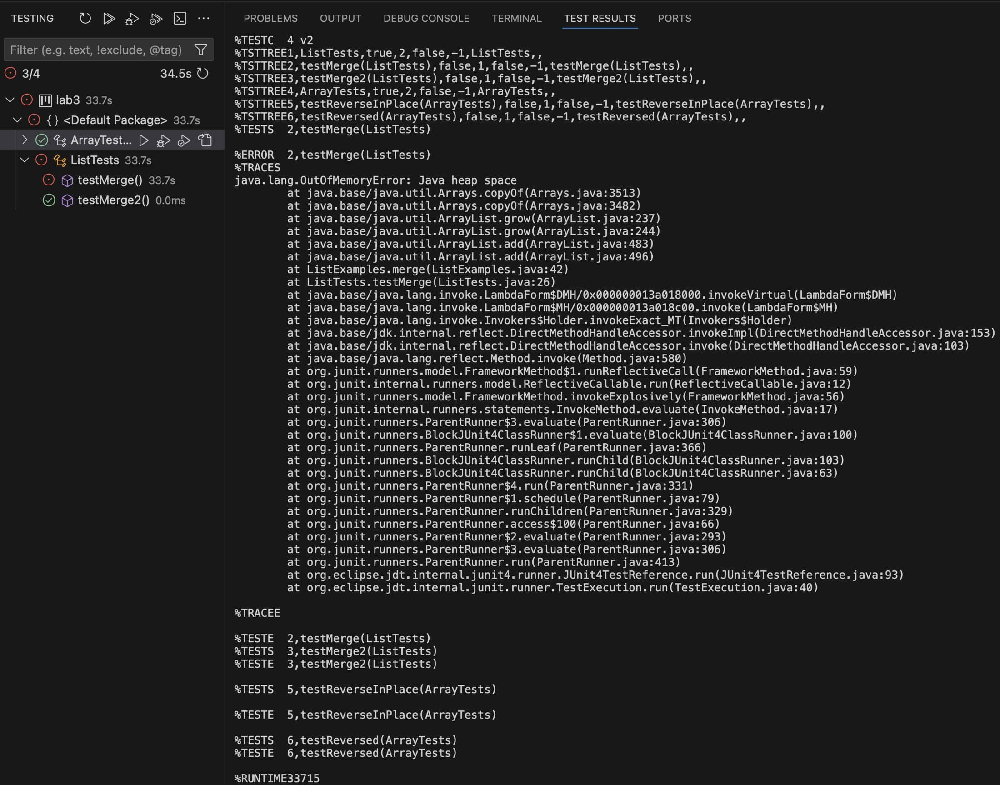

## eryfer ##

### step 1
```
import static org.junit.Assert.*;
import org.junit.*;
import java.util.ArrayList;
import java.util.List;

public class ListTests {

    @Test
    public void testMerge(){
        
        List<String> list1 = new ArrayList<>();
        list1.add("c");
        List<String> list2 = new ArrayList<>();
        list2.add("a");
        list2.add("b");
        list2.add("d");
        list2.add("e");

        List<String> listComparison = new ArrayList<>();
        listComparison.add("a");
        listComparison.add("b");
        listComparison.add("c");
        listComparison.add("d");
        listComparison.add("e");

        assertEquals(listComparison, ListExamples.merge(list1,list2));
    }
}
```
### step 2
```
import static org.junit.Assert.*;
import org.junit.*;
import java.util.ArrayList;
import java.util.List;

public class ListTests {

    @Test
    public void testMerge2(){
        
        List<String> list1 = new ArrayList<>();
        list1.add("a");
        list1.add("b");
        list1.add("d");
        list1.add("e");
        List<String> list2 = new ArrayList<>();
        list2.add("c");

        List<String> listComparison = new ArrayList<>();
        listComparison.add("a");
        listComparison.add("b");
        listComparison.add("c");
        listComparison.add("d");
        listComparison.add("e");

        assertEquals(listComparison, ListExamples.merge(list1,list2));
    }
}
```
### step 3

### step 4
```
// Takes two sorted list of strings (so "a" appears before "b" and so on),
// and return a new list that has all the strings in both list in sorted order.
static List<String> merge(List<String> list1, List<String> list2) {
    List<String> result = new ArrayList<>();
    int index1 = 0, index2 = 0;
    while(index1 < list1.size() && index2 < list2.size()) {
      if(list1.get(index1).compareTo(list2.get(index2)) < 0) {
        result.add(list1.get(index1));
        index1 += 1;
      }
      else {
        result.add(list2.get(index2));
        index2 += 1;
      }
    }
    while(index1 < list1.size()) {
      result.add(list1.get(index1));
      index1 += 1;
    }
    while(index2 < list2.size()) {
      result.add(list2.get(index2));
      index1 += 1;
    }
    return result;
  }
```
vs 
```
// Takes two sorted list of strings (so "a" appears before "b" and so on),
  // and return a new list that has all the strings in both list in sorted order.
  static List<String> merge(List<String> list1, List<String> list2) {
    List<String> result = new ArrayList<>();
    int index1 = 0, index2 = 0;
    while(index1 < list1.size() && index2 < list2.size()) {
      if(list1.get(index1).compareTo(list2.get(index2)) < 0) {
        result.add(list1.get(index1));
        index1 += 1;
      }
      else {
        result.add(list2.get(index2));
        index2 += 1;
      }
    }
    while(index1 < list1.size()) {
      result.add(list1.get(index1));
      index1 += 1;
    }
    while(index2 < list2.size()) {
      result.add(list2.get(index2));
      index2 += 1; //this line is changed from index1 to index2
    }
    return result;
  }
```

